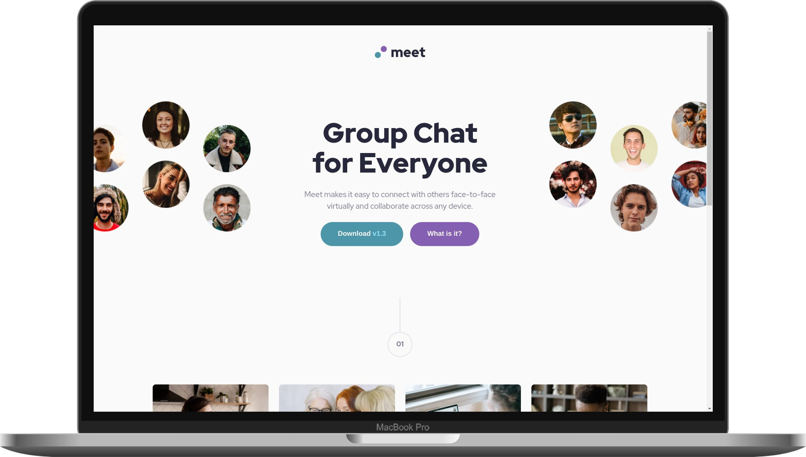

# Frontend Mentor - Meet landing page solution

This is a solution to the [Meet landing page challenge on Frontend Mentor](https://www.frontendmentor.io/challenges/meet-landing-page-rbTDS6OUR). Frontend Mentor challenges help you improve your coding skills by building realistic projects. 

## Table of contents

- [Overview](#overview)
  - [The challenge](#the-challenge)
  - [Screenshot](#screenshot)
  - [Links](#links)
- [My process](#my-process)
  - [Built with](#built-with)
  - [What I learned](#what-i-learned)
  - [Continued development](#continued-development)
- [Author](#author)

## Overview

### The challenge

Users should be able to:

- View the optimal layout depending on their device's screen size
- See hover states for interactive elements

### Screenshot

### Links

- Solution URL: [GitHub](https://github.com/ryanwells-rwc/meet-landing-page)
- Live Site URL: [Netlify](https://meet-landing-page-rwc.netlify.app/)

## My process

### Built with

- Semantic HTML5 markup
- Flexbox
- CSS Grid
- Mobile-first workflow

### What I learned

I learned that setting a negative `z-index` on an element can be useful for 
positioning it behind other elements. However, it can also cause the hover 
effect on buttons to not work.

### Continued development

In the future I would like to get more familiar with the intricacies of CSS Grid. 

## Author

- Website - [Ryan Wells](https://ryanwells.io)
- Frontend Mentor - [@ryanwells-rwc](https://www.frontendmentor.io/profile/ryanwells-rwc)